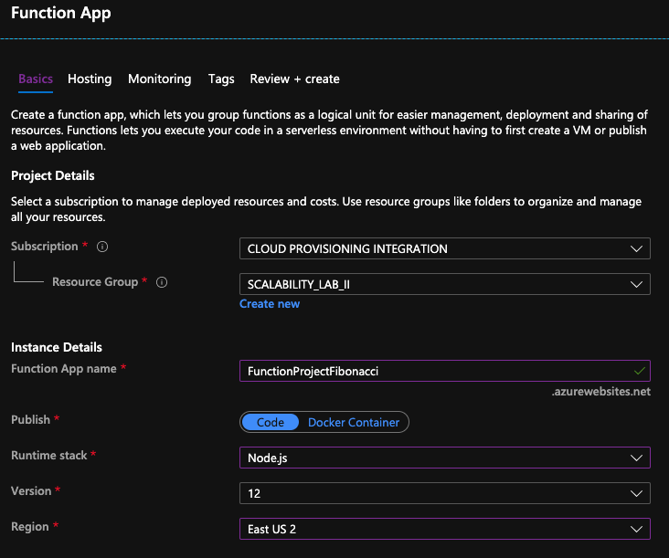
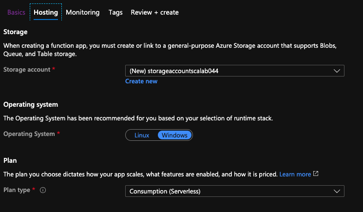
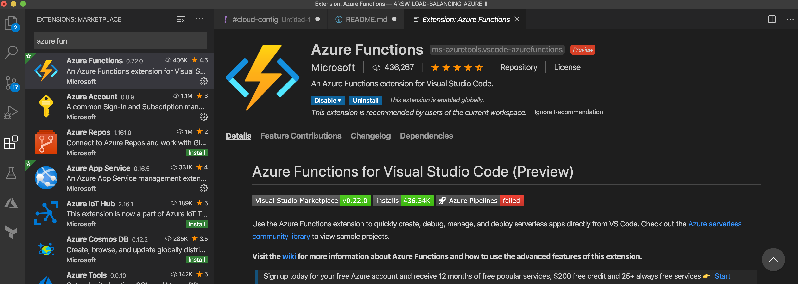
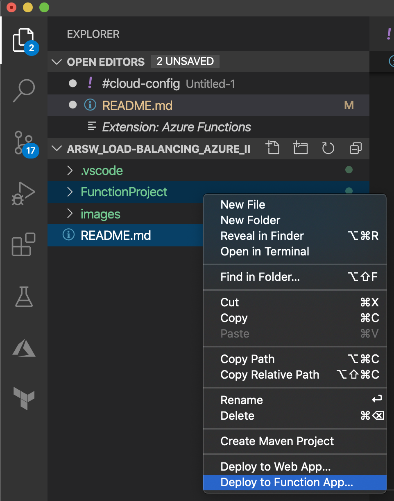
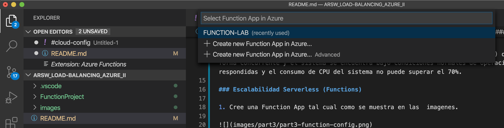
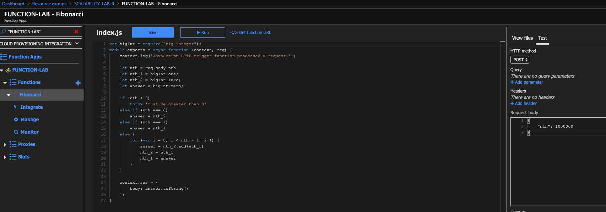

### Escuela Colombiana de Ingeniería
### Arquitecturas de Software - ARSW

## Escalamiento en Azure con Maquinas Virtuales, Sacale Sets y Service Plans

### Dependencias
* Cree una cuenta gratuita dentro de Azure. Para hacerlo puede guiarse de esta [documentación](https://azure.microsoft.com/en-us/free/search/?&ef_id=Cj0KCQiA2ITuBRDkARIsAMK9Q7MuvuTqIfK15LWfaM7bLL_QsBbC5XhJJezUbcfx-qAnfPjH568chTMaAkAsEALw_wcB:G:s&OCID=AID2000068_SEM_alOkB9ZE&MarinID=alOkB9ZE_368060503322_%2Bazure_b_c__79187603991_kwd-23159435208&lnkd=Google_Azure_Brand&dclid=CjgKEAiA2ITuBRDchty8lqPlzS4SJAC3x4k1mAxU7XNhWdOSESfffUnMNjLWcAIuikQnj3C4U8xRG_D_BwE). Al hacerlo usted contará con $200 USD para gastar durante 1 mes.

### Parte 0 - Entendiendo el escenario de calidad

Adjunto a este laboratorio usted podrá encontrar una aplicación totalmente desarrollada que tiene como objetivo calcular el enésimo valor de la secuencia de Fibonnaci.

**Escalabilidad**
Cuando un conjunto de usuarios consulta un enésimo número (superior a 1000000) de la secuencia de Fibonacci de forma concurrente y el sistema se encuentra bajo condiciones normales de operación, todas las peticiones deben ser respondidas y el consumo de CPU del sistema no puede superar el 70%.

### Escalabilidad Serverless (Functions)

1. Cree una Function App tal cual como se muestra en las  imagenes.

2. Instale la extensión de **Azure Functions** para Visual Studio Code.

3. Despliegue la Function de Fibonacci a Azure usando Visual Studio Code. La primera vez que lo haga se le va a pedir autenticarse, siga las instrucciones.

4. Dirijase al portal de Azure y pruebe la function.

5. Modifique la coleción de POSTMAN con NEWMAN de tal forma que pueda enviar 10 peticiones concurrentes. Verifique los resultados y presente un informe.

6. Cree una nueva Function que resuleva el problema de Fibonacci pero esta vez utilice un enfoque recursivo con memoization. Pruebe la función varias veces, después no haga nada por al menos 5 minutos. Pruebe la función de nuevo con los valores anteriores. ¿Cuál es el comportamiento?.

**Preguntas**

* ¿Qué es un Azure Function?

Azure Functions es una solución serverless que nos  permite escribir pequeños fragmentos de código o funciones en la nube, esto con el fin de mantener menos infraestructura y lograr ahorrar costos. En lugar de preocuparse por la implementación y el mantenimiento de los servidores, la infraestructura de la nube proporciona todos los recursos actualizados necesarios para mantener sus aplicaciones en funcionamiento.

Azure function se basa en escala y bajo demanda, por lo que solo se paga por los recursos consumidos; se factura según el número total de ejecuciones solicitadas cada mes para todas las funciones. 

* ¿Qué es serverless?

La computación sin servidor (o serverless para abreviar) es un modelo de ejecución en el que el proveedor en la nube (AWS, Azure o Google Cloud) es responsable de ejecutar un fragmento de código mediante la asignación dinámica de los recursos. Y cobrando solo por la cantidad de recursos utilizados para ejecutar el código. El código, generalmente, se ejecuta dentro de contenedores sin estado que pueden ser activados por una variedad de eventos que incluyen solicitudes HTTP, eventos de base de datos, servicios de colas, alertas de monitoreo, carga de archivos, eventos programados (trabajos cron), etc.

* ¿Qué es el runtime y que implica seleccionarlo al momento de crear el Function App?

Se denomina tiempo de ejecución al intervalo de tiempo en el que un programa de computadora se ejecuta en un sistema operativo.

 En este caso utilizamos el plan Consumption y la versión de runtime 12, lo cual implica que el tiempo de timeout será de 5 minutos y además nuestra memoria se limpiará en este intervalo de tiempo.

* ¿Por qué es necesario crear un Storage Account de la mano de un Function App?

Debido a que las funciones de azure se basan en el servicio Azure Storage para el almacenamiento y administracion como son los disparadores y logs.

* ¿Cuáles son los tipos de planes para un Function App?, ¿En qué se diferencias?, mencione ventajas y desventajas de 
cada uno de ellos.

    * Consumption: Ofrece escalabilidad dinámica y factura solo cuando la aplicación es ejecutada, tiene un timeout es de 5 minutos y brinda una memoria máxima de 1.5 GB por instancia, un almacenamiento de 1 GB y un máximo número de instancias de 200.

    * Premium: Ofrece escalabilidad dinámica, se factura por el número en segundos de core y la memoria usada en las distintas instancias, puede tener timeouts ilimitados, memoria por instancia de 3.5 GB y un almacenamiento de hasta 250 GB, finalmente ofrece un máximo de 100 instancias.
    
    * Dedicated: El cliente puede implementar manualmente la escalabilidad, puede tener timeouts ilimitados, memoría por instancia de 1.7 GB y una capacidad de almacenamiento hasta de 1000 GB y el numero de instancias es máximo 20. En este plan se paga lo mismo que por otros recursos de App Service, como las aplicaciones web

* ¿Por qué la memorizacion falla o no funciona de forma correcta?

* ¿Cómo funciona el sistema de facturación de las Function App?

* Informe

## Referencias

* [Azure funrctions documentation](https://docs.microsoft.com/en-us/azure/azure-functions/)

* [Introduction to Azure Functions](https://docs.microsoft.com/en-us/azure/azure-functions/functions-overview)

* [Computacion serveless](https://serverless-stack.com/chapters/es/what-is-serverless.html)

* [¿Qué es "runtime"?](https://www.it-swarm-es.com/es/terminology/que-es-runtime/970647593/)

* [Descripción general de la cuenta de almacenamiento Azure](https://docs.microsoft.com/en-us/azure/storage/common/storage-account-overview)

* [Tutorial para que funcione Azure-functions correctamente](https://github.com/Azure/azure-functions-core-tools)